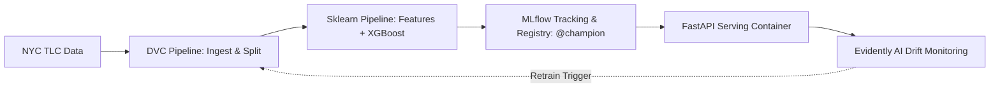

# NYC Green Taxi Trip Duration MLOps

An end-to-end reproducible Machine Learning system that predicts NYC Green Taxi trip duration in minutes. The project demonstrates a modular MLOps workflow incorporating DVC data pipelines, MLflow experiment tracking and model registry, Scikit-learn feature engineering, XGBoost regression, FastAPI serving, Docker containerization, and Evidently AI drift monitoring.

[](https://github.com/duylw/mlops-practice-01/actions/workflows/ci.yml)
[](https://github.com/duylw/mlops-practice-01/actions/workflows/cd.yml)

## Architecture



## Project Structure

```text
src/
  config/      Path definitions and environment settings
  data/        Data ingestion, chronological splitting, and target preparation
  features/    Stateless feature engineering and custom Scikit-learn transformer
  training/    Pipeline training, MLflow tracker, and model registry promotion
  monitoring/  Evidently AI batch drift and quality monitoring
  serving/     FastAPI application, Pydantic schemas, and model loader
  utils/       Geographical calculations and IO utilities
tests/         Unit, integration, and schema tests
reports/       Metrics, model cards, and error analysis plots
```

## Prerequisites

- Python `>= 3.12`
- [`uv`](https://github.com/astral-sh/uv) package manager
- Docker and Docker Compose

## Quickstart

### 1. Environment Setup

Clone the repository and synchronize dependencies:

```bash
uv sync
```

Dependency groups defined in `pyproject.toml`:

| Group | Description |
|---|---|
| Base | Core dependencies (Scikit-learn, XGBoost, MLflow, Pandas, NumPy) |
| `serving` | FastAPI and Uvicorn runtime |
| `training` | DVC, GeoPandas, Optuna, Matplotlib |
| `monitoring` | Evidently AI and PyArrow |
| `dev` | Pytest, Ruff, and HTTP benchmark client |

### 2. Start MLflow Tracking Server

```bash
docker compose up -d mlflow-server
```

MLflow UI will be available at `http://localhost:5000`.

### 3. Run the Training Pipeline

Execute the full reproducible DVC pipeline (Ingest -> Split -> Train -> Register):

```bash
uv run dvc repro
```

View primary evaluation metrics:

```bash
dvc metrics show
```

Key performance metrics (held-out chronological test split):
- **RMSE**: 9.10 minutes
- **MAE**: 4.45 minutes
- **Pipeline Latency**: ~0.007 ms/row

### 4. Hyperparameter Tuning (Optional)

Run Optuna optimization on the validation split:

```bash
uv run python -m src.training.tune --n-trials 20
```

Selected parameters are logged to `reports/tuning.json`. Update `params.yaml` and re-run `dvc repro` to retrain with optimal parameters.

## Model Serving

### Option A: Run via Docker Compose

```bash
docker compose up -d --build serving-api
```

### Option B: Run Pre-built Image from GitHub Container Registry

```bash
docker run -d -p 8000:8000 --name serving-api \
  --network mlops-practice-01_default \
  -e MLFLOW_TRACKING_URI=http://mlflow-server:5000 \
  ghcr.io/duylw/mlops-serving-api:latest
```

### API Verification

Health check:
```bash
curl http://localhost:8000/health
```

Metadata:
```bash
curl http://localhost:8000/metadata
```

Prediction request:
```bash
curl -X POST http://localhost:8000/predict \
  -H "Content-Type: application/json" \
  -d '{
    "trips": [
      {
        "VendorID": 2,
        "lpep_pickup_datetime": "2026-01-15 08:30:00",
        "PULocationID": 74,
        "DOLocationID": 42,
        "passenger_count": 1,
        "trip_type": 1
      }
    ]
  }'
```

Response format:
```json
{
  "predictions": [10.17],
  "model_name": "green_taxi_duration_model",
  "model_version": 1,
  "model_alias": "champion",
  "latency": 0.015
}
```

### Benchmark Serving Latency

```bash
uv run python scripts/benchmark_serving.py --request-count 20
```

Tests batch sizes (`1`, `10`, `100`) across concurrency levels (`1`, `5`, `10`) and outputs p50/p95/p99 latency percentiles.

## Batch Monitoring

Run Evidently AI batch monitoring comparing a current dataset against the reference training distribution:

```bash
uv run python -m src.monitoring.run \
  --current-path data/split/test_raw.parquet \
  --current-name test-2026-04
```

Reports (HTML/JSON) and drift metrics are exported to `reports/monitoring/` and logged to the `green_taxi_duration_monitoring` MLflow experiment.

## Testing & Quality Gates

Run the local test and lint suite:

```bash
uv run ruff check src tests scripts
uv run pytest
uv run python -m compileall src
```

### CI/CD Automation

- **CI (`.github/workflows/ci.yml`)**: Triggers on pull requests and pushes to `main`. Runs linting, 19 unit tests, syntax compilation, and Docker build dry-run verification.
- **CD (`.github/workflows/cd.yml`)**: Triggers on pushes to `main` and release tags (`v*.*.*`). Builds and releases multi-tag container images to GitHub Container Registry (GHCR).
